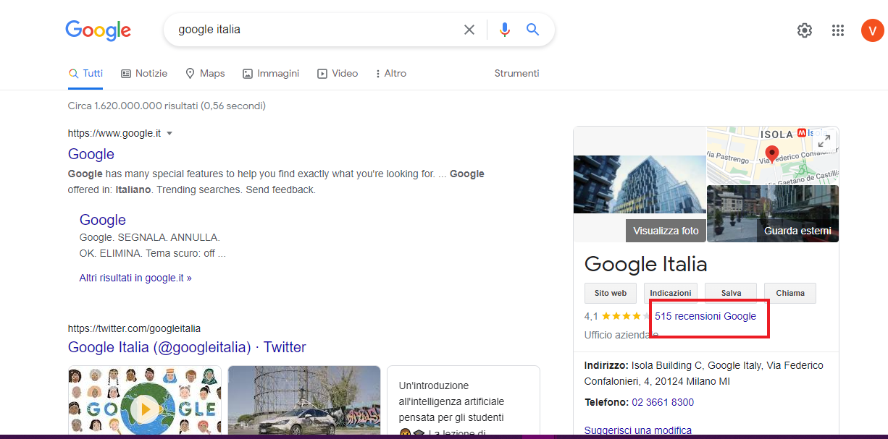
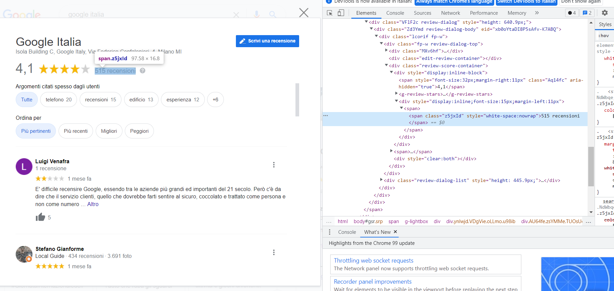
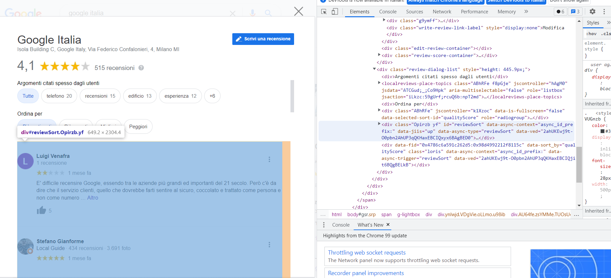
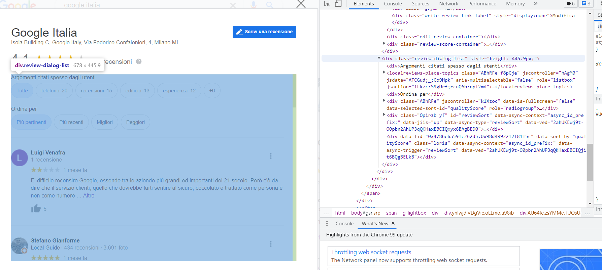
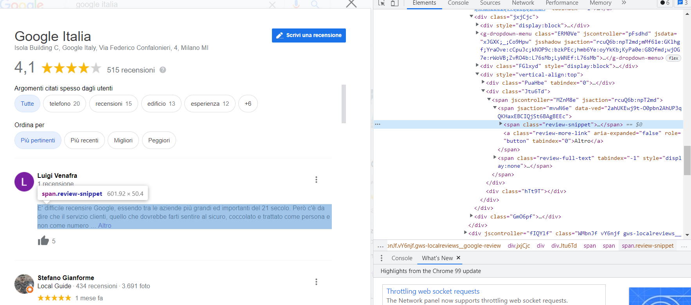
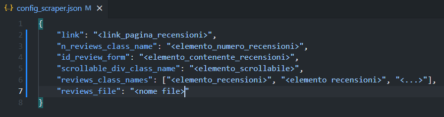

# ***Web Scraper di Recensioni Google***

>La seguenta guida illustra come utilizzare e configurare il **Web Scraper** realizzato con [*Selenium*](https://www.selenium.dev/).
> 
>Il programma è stato sviluppato per raccogliere dati testuali per un progetto di ***Natural Language Processing*** svolto durante il mio periodo di stage presso [*BSdesign Srl*](https://www.bsdesign.eu/).
---

## ***Indice***
- [Installazione](#inst)
- [Modalità d'uso](#use)
- [Configurazione JSON file ](#conf)
- [Avvio Programma](#start)
- [Conclusioni](#end)

---

## ***Installazione***
Per utilizzare il ***Web Scraper*** è necessario avere una versione di [Python](https://www.python.org/) installata sul proprio dispositivo, io ho utilizzato la versione ***3.9.7***.

Per comodità consiglio di installare [Anaconda](https://www.anaconda.com/products/individual), in modo da gestire più facilmente il setup di un ***ambiente virtuale***.

Dopo aver installato Anaconda, create un ambiente virtuale con il seguente comando:

    conda create -n <Nome Ambiente> python=3.9.7

Successivamente attivate l'ambiente con:

    conda activate <Nome Ambiente>

Infine dopo esservi collocati nella cartella da linea di comando, eseguite il seguente comando per installare tutte le dipendenze necessarie per il programma:

    pip install -r requirements.txt

Per una guida più dettagliata su Anaconda e gli ambienti virtuali vi consiglio questo [sito](https://www.geeksforgeeks.org/set-up-virtual-environment-for-python-using-anaconda/).

---

## ***Modalita d'uso***

Prima di utilizzare il Web Scraper è necessario svolgere un primo lavoro di ***analisi*** della pagina di recensioni.

In particolare bisogna raccogliere tutti gli ***elementi HTML*** della pagina necessari al web scraper per funzionare, in questo caso dovremmo raccogliere ***4*** elementi:
>
>1. elemento contenente il numero totale di recensioni
>2. elemento contenente le recensioni
>3. elemento scrollabile 
>4. elemento contenente una recensione

Prima di tutto ci serve l'***URL*** della pagina, il web scraper si basa su questa pagina di recensioni:

La pagina qui sopra,  la si può trovare cliccando dove indica il rettangolo rosso:

---

### *Numero totale di recensioni*

Grazie allo strumento "Ispeziona" del motore di ricerca, dobbiamo recuperare l'elemento contenente il numero di recensioni:

 In questo caso teniamo come elemento di riferimento la classe, di conseguenza dobbiamo tenere il valore :
>***class = "z5jxId"*** 
---
### *Box contenente le recensioni*

Poi abbiamo bisogno dell'elemento contenente le recensioni:

Questa volta, siccome è presente, terremo in considerazione l'***ID*** siccome identifica univocamenteun elemento di una pagina HTML:

>***id = "reviewSort"***
---

### *Elemento scrollabile* 
Seguendo la stessa procedure dei punti precedenti:

Teniamo in considerazione:

> ***class="review-dialog-list"***
---
### *Box contenente una recensione*

Nel caso dei singoli box contenenti le recensioni, è possibile che ci siano più nomi possibili per le classi, di conseguenza necessità di un analisi più approfondita.

Valori da considerare:
> ***class="review-snippet"***

Una volta raccolti tutti questi elementi bisogna configurare il file [JSON](https://www.json.org/json-it.html) "**config_scraper.json**".

---

## ***Configurazione JSON file***
Come anticipato nella sezione precedente, bisogna configurare il file json che si presenta in questo modo:

