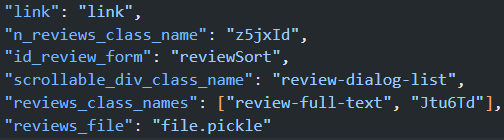

# ***Scraper of Google's reviews***

>This guide illustrate how to use and configure this **Web Scraper** made with [*Selenium*](https://www.selenium.dev/).
> 
>This program was developed for gathering textual data for a ***Natural Language Processing*** project during my time at [*BSD design*](https://www.bsdesign.eu/).
---

## ***Contents***
- [Set up](#inst)
- [Web page](#use)
- [Configuring Json file](#conf)
- [Run program](#start)

---

## ***Set up***
First, you need to install [Python](https://www.python.org/), i've used ***3.9.7*** version.

I recommend installing [Anaconda](https://www.anaconda.com/products/individual) because you can manage ***virtual environments*** more easily.

After installing Anaconda, you can create a virtual environment with the folllowing command from terminal:

    conda create -n <Env's name> python=3.9.7

Activate it with:

    conda activate <Env's name>

Then install dependences with:

    pip install -r requirements.txt

More details on Anaconda and virtual environments at this [site](https://www.geeksforgeeks.org/set-up-virtual-environment-for-python-using-anaconda/).

---

## ***Web page***

This scraper works only on this type of page :

You can find the above page by clicking where indicated by the red box :

---

## ***Configuring JSON file***
Here we can see how the Json file present itself:

You only need to change:
- "link": url
- "reviews_file": filename.pickle

Remember to always choose ***.pickle*** format.

---

## ***Run program***
From terminal:

    python scraper.py

Or from the start button of your preferred ***IDE***.

